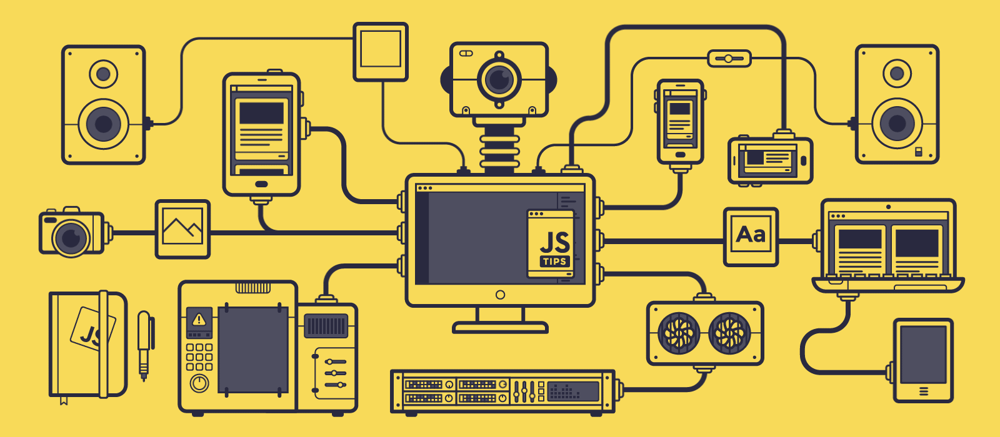

  

 

👋 Hi, I'm @F3RL4 
🛠️ Senior Systems Engineer with 15+ years across telecom and software engineering (Minsait, Claro, Nokia Siemens), now focused on building AI-powered systems. 
🤖 I design and build AI Multi-Agent Systems for intelligent automation, code generation, and workflow orchestration, alongside full-stack development from design to delivery. 
📡 My background started in mission-critical telecom network operations (DWDM, SDH, IP, mobile networks), which still shapes how I think about reliability and scale in the systems I build today. 
🌱 Always learning — currently going deeper into agentic AI architectures and how to integrate them into real enterprise environments. 
🏞️ Outside of work, I'm into hiking, gardening, and I'm fascinated by the vastness of space and the possibilities of life beyond Earth. 
💞️ Open to collaborations and conversations on AI, multi-agent systems, telecom, and next-generation system architectures. 
📫 Reach me at efa.ferla@gmail.com

####      
                                                    

<h2 font-weight="bold">Process</h2>

  

<h2 font-weight="bold">𝐒𝐤𝐢𝐥𝐥s</h2>
<!--  -->

<table align="center">
  <tr>
    <td align="center" width="90">
      
       React
    </td>
    <td align="center" width="90">
      
       Redux
    </td>
    <td align="center" width="90">
      
       Next.js
    </td>
    <td align="center" width="90">
      
       Gatsby
    </td>
    <td align="center" width="90">
      
       Vue
    </td>
    <td align="center" width="90">
      
       Nuxt.js
    </td>
    <td align="center" width="90">
      
       Angular
    </td>
    <td align="center" width="90">
      
       Nest.js
    </td>
    <td align="center" width="90">
      
       Node.js
    </td>
    <td align="center" width="90">
      
       Express
    </td>
  </tr>
  <tr>
    <td align="center" width="90">
      
       Svelte
    </td>
    <td align="center" width="90">
      
       WordPress
    </td>
    <td align="center" width="90">
      
       Typescript
    </td>
    <td align="center" width="90">
      
       PHP
    </td>
    <td align="center" width="90">
      
       Laravel
    </td>
    <td align="center" width="90">
      
       Python
    </td>
    <td align="center" width="90">
      
       Django
    </td>
    <td align="center" width="90">
      
       Flask
    </td>
    <td align="center" width="90">
      
       Ruby
    </td>
    <td align="center" width="90">
      
       RestAPI
    </td>
  </tr>
  <tr>
    <td align="center" width="90">
      
       D3.js
    </td>
    <td align="center" width="90">
      
       MaterialUI
    </td>
    <td align="center" width="90">
      
       Tailwind
    </td>
    <td align="center" width="90">
      
       HTML
    </td>
    <td align="center" width="90">
      
       CSS
    </td>
    <td align="center" width="90">
      
       Sass
    </td>
    <td align="center" width="90">
      
       Bootstrap
    </td>
    <td align="center" width="90">
      
       Babel
    </td>
    <td align="center" width="90">
      
       Three.js
    </td>
    <td align="center" width="90">
      
       Solidity
    </td>
  </tr>
  <tr>
    <td align="center" width="90">
      
       AWS
    </td>
    <td align="center" width="90">
      
       MDB
    </td>
    <td align="center" width="90">
      
       MySQL
    </td>
    <td align="center" width="90">
      
       PostgreSQL
    </td>
    <td align="center" width="90">
      
       SQLite
    </td>
    <td align="center" width="90">
      
       Flutter
    </td>
    <td align="center" width="90">
      
       Android
    </td>
    <td align="center" width="90">
      
       Java
    </td>
    <td align="center" width="90">
      
       C#
    </td>
    <td align="center" width="90">
      
       C++
    </td>
  </tr>
  <tr>
    <td align="center" width="90">
      
       Azure
    </td>
    <td align="center" width="90">
      
       GCP
    </td>
    <td align="center" width="90">
      
       Docker
    </td>
    <td align="center" width="90">
      
       Kubernetes
    </td>
    <td align="center" width="90">
      
       Terraform
    </td>
    <td align="center" width="90">
      
       Ansible
    </td>
    <td align="center" width="90">
      
       Linux
    </td>
    <td align="center" width="90">
      
       Actions
    </td>
    <td align="center" width="90">
      
       Grafana
    </td>
    <td align="center" width="90">
      
       Prometheus
    </td>
  </tr>
  <tr>
    <td align="center" width="90">
      
       PyTorch
    </td>
    <td align="center" width="90">
      
       TensorFlow
    </td>
    <td align="center" width="90">
      
       Scikit-Learn
    </td>
    <td align="center" width="90">
      
       OpenCV
    </td>
    <td align="center" width="90">
      
       Anaconda
    </td>
    <td align="center" width="90">
      
       FastAPI
    </td>
    <td align="center" width="90">
      
       Redis
    </td>
    <td align="center" width="90">
      
       Kafka
    </td>
    <td align="center" width="90">
      
       Elastic
    </td>
    <td align="center" width="90">
      
       RabbitMQ
    </td>
  </tr>
</table>

